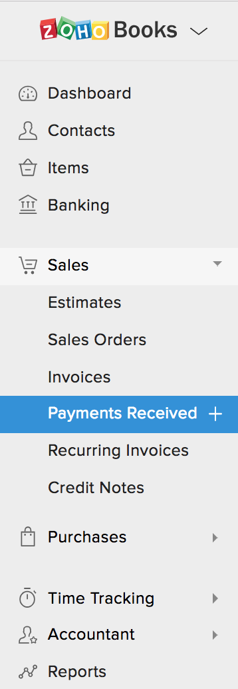
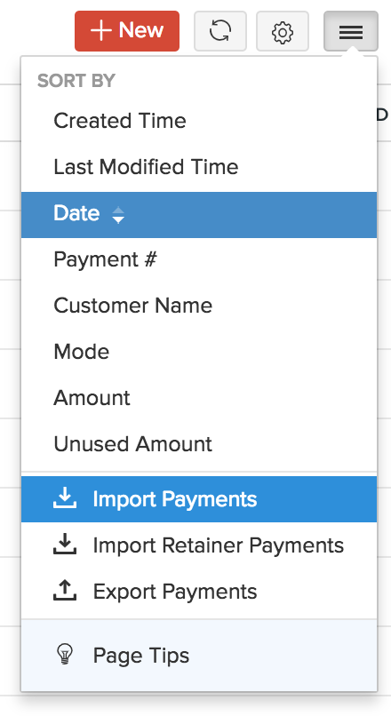
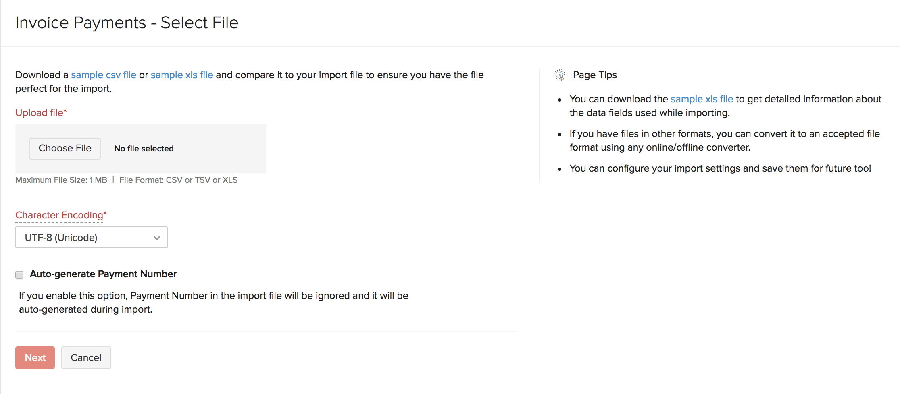

# iZettle export for Zoho Books

This is a quick script to export values from [iZettle](https://www.izettle.com/gb) and output in a csv format to allow for importing into [Zoho books](https://www.zoho.com/uk/books/) payments received.

It makes use of the [iZettle API](https://www.izettle.com/gb/developer) which you will need to request to get access to it for your account. More detail about the API can be found in iZettle [documentation](https://github.com/iZettle/api-documentation). 

You will need to set some env vaiables based on your account.

```
export IZETTLE_CLIENT_ID="cfbf9ef1-5423-4f82-a3d6-xxxxxxxxxxxxx"
export IZETTLE_CLIENT_SECRET="IZSEC83547937-5e57-45fb-a394-xxxxxxxxxxxx"
export IZETTLE_USERNAME="name@domain.com"
export IZETTLE_PASSWORD="letmein"
```

To run you need to specify the date range to want extracting;

```
$ ./izettle_export.sh 2018-08-01 2018-08-05

```

The output will be a CSV format, you can save this and then input into Zoho (not yet created the input using Zoho API, and probably will not get round to it.). It will extract both cash and card payments including the transaction fee.

```
Payment Number,Customer Name,Date,Mode,Exchange Rate,Amount,Description,Bank Charges,Invoice Number,Invoice Amount,Withholding Tax Amount
201808011,shop,2018-08-01,Cash,,79.15,Cash Payment,,,,
201808012,shop,2018-08-01,iZettle,,85.10,Tide,1.52,,,
201808021,shop,2018-08-02,Cash,,77.00,Cash Payment,,,,
201808022,shop,2018-08-02,iZettle,,99.20,Tide,1.74,,,
201808031,shop,2018-08-03,Cash,,169.95,Cash Payment,,,,
201808032,shop,2018-08-03,iZettle,,209.25,Tide,3.70,,,
201808041,shop,2018-08-04,Cash,,87.80,Cash Payment,,,,
201808042,shop,2018-08-04,iZettle,,151.10,Tide,2.65,,,
201808051,shop,2018-08-05,Cash,,68.30,Cash Payment,,,,
201808052,shop,2018-08-05,iZettle,,121.40,Tide,2.14,,,
```

Once you have the CSV file saved you can input in;



